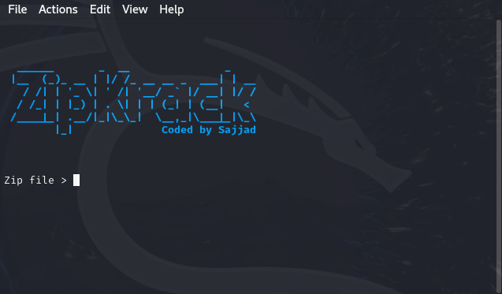

<h1 align="center">ZipKrack v1.1</h1>
<p align="center">
</p>

# ZipKrack
ZipKrack is a tool designed to crack the passwords of zip files. It offers a simple and effective way to recover passwords used to secure zip archives.

# Tested on
- Kali Linux
- Ubuntu
- Termux

# Installation
`apt install python3`

`apt install git`

`git clone https://github.com/Cyber-Anonymous/ZipKrack.git`
`cd ZipKrack`

`python3 zipkrack.py`

# Help
```bash

     zipfile          :   Specify the zip file.
     password list    :   Specify the password list.
     help             :   Show help.
     quit             :   Exit from the tool.
     --version        :   Display the version of ZipKrack.
     --help           :   Show help.

```

## Screenshot

<p align="center">
    
</p>

# Warning
**This tool is intended for educational purposes only. The developers are not responsible for any misuse or illegal activities conducted with this tool.**
